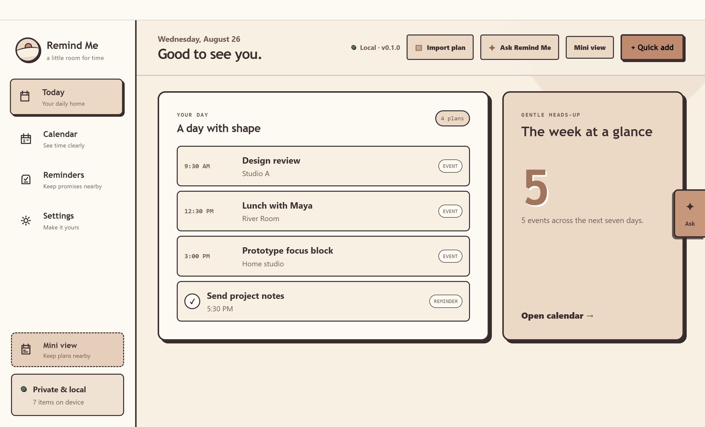
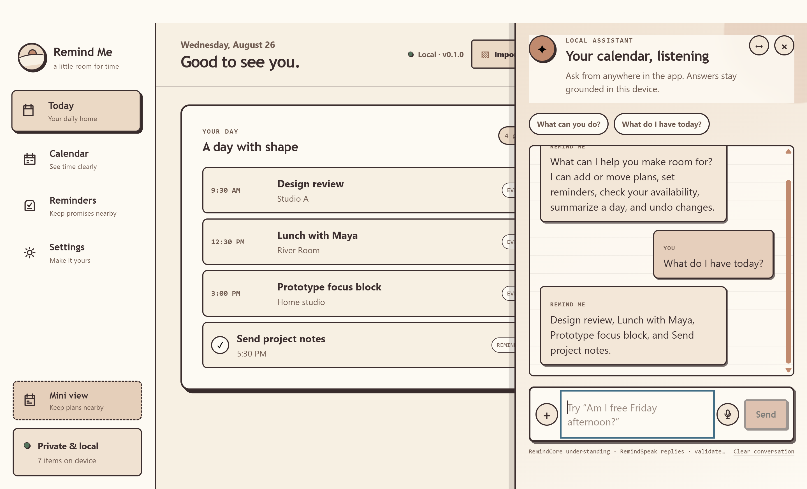
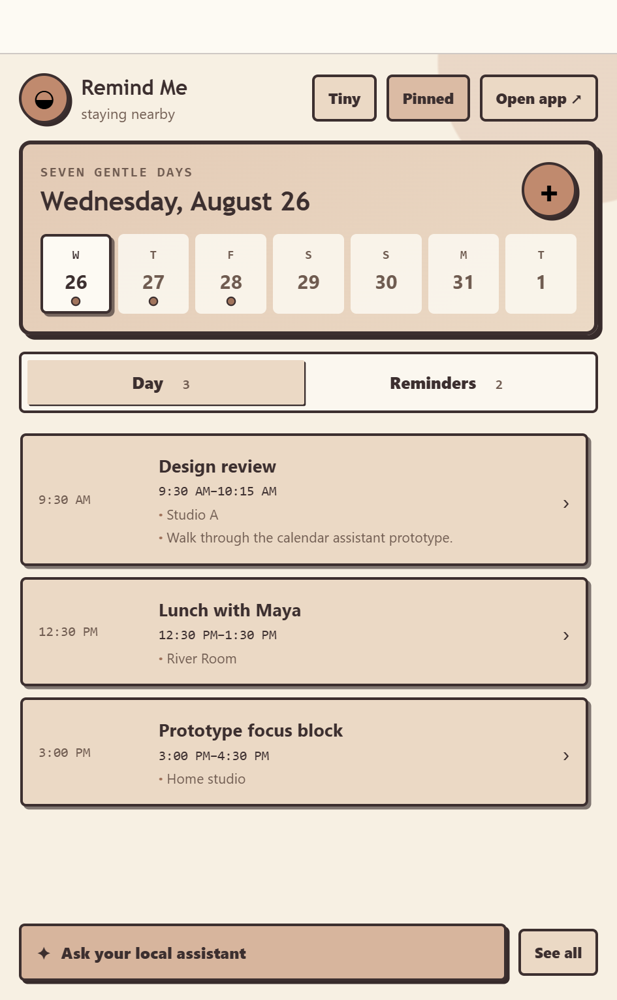
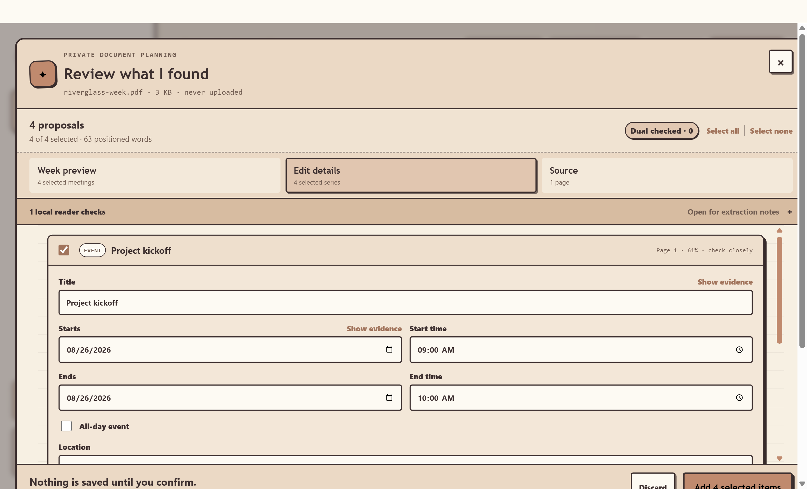
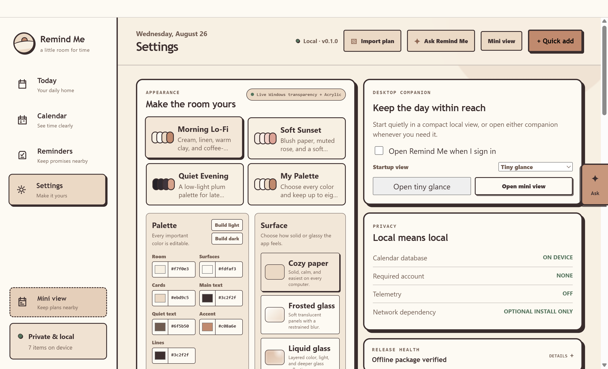
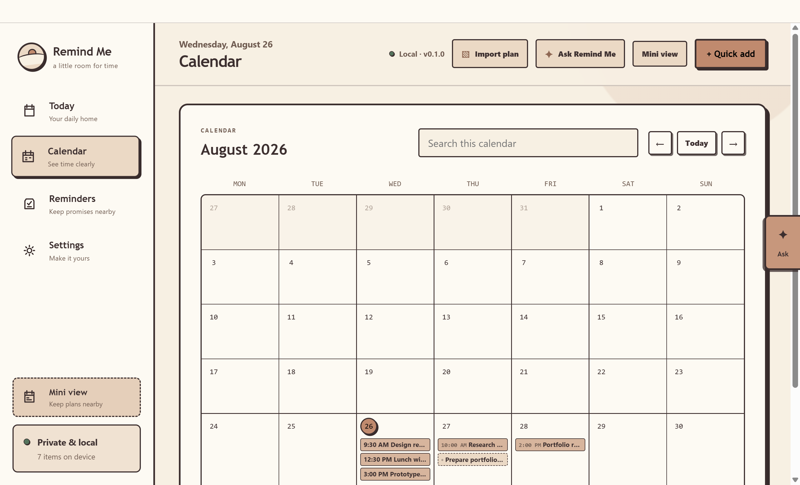

<p align="center">
  
</p>

<h1 align="center">Remind Me</h1>

<p align="center">
  A private, local-first calendar assistant for natural language, live voice, PDFs, and images.
</p>

<p align="center">
  <a href="https://github.com/alsoedgar/remind-me/actions/workflows/ci.yml"></a>
  
  
  <a href="LICENSE"></a>
</p>

Remind Me turns everyday requests into safe calendar changes: type “move my design review to Friday,” speak while a live transcript appears, or drop in a schedule PDF and review every extracted meeting before it is saved. Calendar math, recurrence, conflict checks, confirmation, persistence, and undo remain deterministic even when a local model helps interpret the wording.

## Download

**[Download Remind Me 0.1.4 for Windows x64](https://github.com/alsoedgar/remind-me/releases/latest/download/Remind-Me-Setup-0.1.4-Windows-x64.exe)**

The current community installer is unsigned, so Windows SmartScreen may ask for confirmation. It keeps the existing local database during upgrades and uninstall by default. macOS and Linux are supported by the application and release configuration; native signed downloads require the corresponding signing credentials.

## Preview

All preview data below is synthetic. The captures are produced by the production renderer through the offline smoke harness.



| Ask in natural language                                                                                            | Keep the calendar nearby                                                                                               |
| ------------------------------------------------------------------------------------------------------------------ | ---------------------------------------------------------------------------------------------------------------------- |
|  |  |

| Review a document before saving                                                                                     | Customize the full desktop experience                                                                               |
| ------------------------------------------------------------------------------------------------------------------- | ------------------------------------------------------------------------------------------------------------------- |
|  |  |

<details>
  <summary>Month calendar preview</summary>

  
</details>

## What it can do

- Create, move, rename, duplicate, repeat, complete, and delete events or reminders from typed or spoken requests.
- Handle single actions and reviewed multi-action batches, including whole-day schedule copies and recurring weekday patterns.
- Answer grounded questions such as “what’s my first class today?”, “am I free Friday afternoon?”, or “tell me more about tomorrow,” then keep the selected item in context for concise follow-ups such as “what room?”, “when does it start?”, or “what should I bring?”
- Transcribe speech live with a bundled offline English Zipformer model; audio stays in memory and the transcript remains editable.
- Read born-digital PDFs locally, fall back to offline OCR for scanned PDFs and images, reconstruct schedule rows, and let the optional Qwen pack group exact source blocks only when PlanScan/rules leave a coverage gap.
- Preserve lectures, labs, recurrence days, date ranges, times, and locations without silently creating arranged or asynchronous meetings that have no fixed time.
- Import/export ICS, back up and restore JSON, schedule native notifications, and persist everything in local SQLite.
- Optionally connect a Canvas account with a device-protected personal token, review upcoming assignment due dates, and add only selected items as local reminders or all-day calendar entries.
- Run as a full app, a pinned 420 × 680 mini calendar, or a tiny glance window at sign-in.
- Customize palettes, density, typography contrast, and paper, frosted-glass, or liquid-glass surfaces.

## Why the implementation is interesting

This project is deliberately more than an Electron shell around an API:

- **Three original local models.** RemindCore, RemindSpeak, and PlanScan are initialized and trained from scratch in this repository, quantized to INT8, exported to ONNX for parity checks, and served by dependency-free TypeScript inference paths.
- **A bounded hybrid assistant.** Rules, project-trained models, and an optional small Qwen fallback can interpret language, but none of them can write SQLite or invent executable timestamps. Every mutation compiles into validated intermediate representation and a deterministic dry run.
- **Evidence-gated document understanding.** PDF.js/Tesseract provide text and geometry; PlanScan links fields spatially; exact source spans, page IDs, and bounding boxes must validate before a proposal can reach review.
- **Protected response generation.** RemindSpeak varies tone and phrasing around immutable placeholders. A second validator rejects missing facts, duplicate placeholders, unsupported literals, and recent repetition.
- **Real release engineering.** The app verifies model hashes and golden predictions at startup, contains failure-safe rules fallbacks, isolates heavy inference in disposable workers, hardens Electron fuses, audits package contents, and exercises the production preload/IPC boundary offline.
- **Cross-platform by construction.** The same TypeScript calendar core, SQLite schema, browser OCR worker, and WASM speech runtime run on Windows, macOS, and Linux; CI regenerates models and tests native packages on all three operating systems.

### Local intelligence stack

| Component                        | Role                                                                               | Footprint and boundary                                                                                                       |
| -------------------------------- | ---------------------------------------------------------------------------------- | ---------------------------------------------------------------------------------------------------------------------------- |
| **RemindCore HashFrame Next**    | Intent, operation, source-span, ambiguity, OOD, risk, and native capability advice | 4.89M parameters; zero initialization; confidence-gated; cannot resolve or execute calendar actions                          |
| **RemindSpeak PhraseLattice**    | Varied, style-aware grounded replies                                               | 28.31M logical sparse entries; 223 KiB compressed; protected facts are inserted only after validation                        |
| **PlanScan SpatialHashGraph**    | Layout-aware PDF/image field and row grouping                                      | 5.24M parameters; about 22 KiB compressed; exact-evidence links only; no OCR or database access                              |
| **Zipformer INT8 + sherpa-onnx** | Streaming English speech recognition                                               | 43.3 MiB model; live partial transcripts; lazy isolated process with idle unload                                             |
| **Optional Qwen3 1.7B Q4_K_M**   | Broader language fallback plus evidence-ID grouping for missed PDF/image items     | Explicit ~1.19 GiB install; local llama.cpp inference; removable; never emits document values or receives mutation authority |

The current RemindCore checkpoint reports 97.73% operation accuracy and 100% precision on eligible assisted candidates on its generated held-out split. PlanScan reports 100% born-digital execution equivalence and 79.2% OCR-like end-to-end equivalence on its tracked synthetic runtime fixture. These are reproducible generated-data measurements, not claims of universal real-world accuracy. The [Phase 8 protocol](evals/assistant/human-blind/protocol-v1.md) implements a consented, contamination-audited human gate, but its honest collection count is still zero and no independent result is claimed.

## Safety-first architecture

```text
typed text or editable voice transcript
              │
              ▼
rules + RemindCore + optional isolated language fallback
              │ exact source spans only
              ▼
validated CalendarIR draft ──► deterministic date/recurrence/target resolver
              │
              ▼
dry-run diff and explicit review ──► one SQLite transaction ──► one undo receipt

PDF/image bytes ──► PDF.js or Tesseract ──► PlanScan evidence graph ──┘
```

Important invariants:

- Models never own UTC conversion, timezones, DST, recurrence expansion, conflict checks, or storage.
- Destructive, ambiguous, series-wide, and bulk changes require review.
- Document bytes, OCR text, thumbnails, and recordings are temporary. Processing stays local by default; optional OpenAI document review sends only the page images and extracted text the user explicitly chooses to review online. Voice recordings stay local.
- The required models work out of the box; the optional language pack is the only explicit model download.
- Context isolation, renderer sandboxing, strict Zod IPC contracts, custom protocol restrictions, and hardened Electron fuses protect the desktop boundary.

See the [architecture overview](docs/architecture/overview.md), [request-routing design](docs/architecture/request-routing.md), [local document pipeline](docs/architecture/local-document-planning.md), [offline voice boundary](docs/architecture/offline-voice.md), and [release hardening notes](docs/architecture/release-hardening.md).

## Development

### Requirements

- Node.js 22.12 or newer
- pnpm 11.19 (pinned in `package.json`)
- Python 3.12 only when retraining the original models

### Run locally

```bash
corepack enable
pnpm install
pnpm models:fetch
pnpm dev
```

`models:fetch` restores the ignored third-party speech artifacts from immutable, checksum-pinned sources. Installed releases already contain every required model.

### Verify and package

```bash
pnpm verify
pnpm package:dir
pnpm documents:release:package
pnpm package:audit
pnpm package:installer
```

The complete gate includes formatting, linting, type checking, 300+ unit/integration tests, 256 language-to-execution golden fixtures across 17 calendar operations, model parity and integrity checks, document fixtures, a production build, and an offline Electron smoke test that crosses renderer, preload, main, utility-process, and SQLite boundaries.

After packaging, `documents:release:package` drives native PDF, scanned PDF, direct-image OCR, and multi-page recurrence fixtures through the actual packaged Electron worker and review UI with networking disabled. It requires exact proposals, aligned visible evidence, no write before confirmation, atomic commit, same-source duplicate lockout, distinct CRN/component identity, and one-action undo. CI records this gate independently on Windows x64, Linux x64, macOS arm64, and macOS x64.

Useful focused commands:

```bash
pnpm eval:assistant:baseline
pnpm eval:assistant:release-phase7
pnpm eval:assistant:human-blind:status
pnpm remindcore:check
pnpm remindcore-next:check
pnpm remindspeak:check
pnpm planscan:check
pnpm documents:fixtures:check
pnpm documents:release:package
pnpm flex:benchmark
pnpm eval:flex-model:phase6:check
pnpm eval:flex-model:phase7:check
```

## Repository map

```text
apps/desktop/              Electron main, preload, renderer, workers, packaging
packages/contracts/        Strict Zod IPC and model-facing schemas
packages/calendar-engine/  Deterministic date, recurrence, conflict, and dry-run logic
packages/assistant-core/   Parsing, routing, retrieval, grounding, and response validation
packages/storage/          SQLite migrations, transactions, undo, and assistant orchestration
packages/importers/        ICS, PDF/image planning, and PlanScan integration
packages/model-runtime/    Verified local model loaders and TypeScript INT8 inference
ml/                        Reproducible generators, training pipelines, reports, and model cards
evals/                     Frozen assistant and runtime evaluation suites
fixtures/                  Golden language, audio, and document fixtures
docs/                      Architecture decisions, privacy inventory, and release notes
```

## Highlights

Concise ways to describe the project without overstating the research results:

- Built a cross-platform, local-first Electron/React/TypeScript calendar assistant with SQLite, natural-language bulk operations, streaming offline ASR, PDF/OCR schedule ingestion, native notifications, widgets, themes, atomic confirmation, and undo.
- Designed and trained three compact task-specific models from zero initialization, implemented INT8 TypeScript inference and ONNX parity export, and combined them with deterministic safety boundaries and an optional quantized 1.7B fallback.
- Engineered an evidence-grounded document pipeline that reconstructs recurring schedules from positioned PDF/OCR text while requiring exact source spans and editable human review before persistence.
- Hardened and tested the production desktop boundary with sandboxed renderers, strict IPC validation, isolated model workers, first-launch artifact attestation, offline end-to-end smoke coverage, package audits, and a three-OS CI matrix.

Good interview discussion areas include why calendar execution remains deterministic, how confidence gating limits model authority, why response facts use protected placeholders, how synthetic evaluations can mislead, and how worker lifetime and quantization trade accuracy for install size and responsiveness.

## Privacy and limitations

Remind Me has no account requirement, telemetry, or required server. Calendar data and assistant history are stored on the device. The optional language pack is downloaded only after explicit consent, verified by SHA-256, and used locally afterward. Canvas is opt-in and read-only: when connected, the app sends a device-protected personal token only to the Canvas site the user chooses, fetches assignments on request, and saves only user-selected due dates locally. The token is excluded from backups.

Settings also offers an optional **Connect OpenAI** API connection. Users supply their own API key, which is protected by the operating system and excluded from backups. A separate switch enables online interpretation of complex assistant requests and shares bounded conversation, profile and relevant calendar context. Simple commands remain local. In a document review, **Send pages to OpenAI** explicitly shares the indicated page images and source text to check missed event groupings. Results must pass source-ID validation and deterministic scheduling before joining the existing editable batch. Requests use Structured Outputs, `store: false`, bounded responses, timeouts and cancellation; these settings do not promise zero provider retention. API access and billing are separate from ChatGPT sign-in. See [online assistance](docs/architecture/online-assistance.md).

Current limitations include English-only speech and language handling, an unsigned first Windows release, a pending independently human-authored Phase 8 benchmark, and imperfect OCR on noisy scans. The app surfaces uncertainty and preserves review/fallback paths instead of treating model output as authoritative.

## License

MIT. Third-party model and dataset notices are documented in [models/THIRD_PARTY_NOTICES.md](models/THIRD_PARTY_NOTICES.md).
