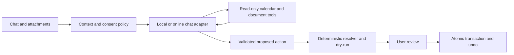

# Remind Me implementation plan

Prepared September 5, 2026 from the [source audit](../audits/2026-09-05-remind-me-audit.md). All work below is proposed. Existing application changes were not edited by the audit.

The intended product is a dependable calendar and reminder app with a capable conversational assistant, broad document intake and optional connected services. Local use remains available without an account. Online processing is a visible user choice.

## Delivery order

Sizes are relative engineering scope, not calendar commitments: S is a focused change, M spans several components, L needs a migration/integration plus end-to-end validation. External approvals and provider testing can dominate elapsed time.

| Milestone | Deliverable                                                  | Size | Dependencies / completion gate                                        |
| --------- | ------------------------------------------------------------ | ---- | --------------------------------------------------------------------- |
| M0        | Date, completion, display, backup and import integrity fixes | M    | First. Deterministic regression suite passes with an injected clock.  |
| M1        | Feature boundaries and shared application services           | M    | Begin alongside M0; extract only what subsequent milestones need.     |
| M2        | Settings navigation and reliable reminder delivery           | L    | M0 and relevant M1 services; packaged lifecycle tests.                |
| M3        | Provider-independent chat with one online provider           | L    | M1; input, privacy, credentials, streaming and tool validation gates. |
| M4        | Rich reminders/events and recurrence editing                 | L    | M0/M2; stable occurrence identity and migrations.                     |
| M5        | General attachments and improved extraction                  | L    | Existing extraction retained; use M3 for optional vision.             |
| M6        | ICS subscriptions and Canvas connection redesign             | L    | M0 ICS fidelity and external identity; school dependencies for OAuth. |
| M7        | Google/Outlook read sync, scale and release hardening        | L    | M6 sync engine; account authorization and provider test tenants.      |

Run a small ChatGPT/Codex sign-in experiment during M1/M3. Its result decides whether to add that adapter; it is not a dependency for direct API chat. Defer two-way calendar sync until read sync handles edits, cancellations, recurrence and reconnect correctly.

## M0: fix correctness before expansion

1. Parse range years jointly and validate every temporal window before dry-run. Add a `Clock` port used by assistant resolution, reminder scheduling and tests. Cover past explicit dates, year-crossing ranges, leap days and DST. The phrase “September 2 through September 4, 2026” must resolve identically before and after those dates; invalid reversed ranges return a clarification/error, never an uncaught schema exception.
2. Preserve reminder completion during edits and provider refreshes. Add an explicit reopen command. Make completion address `{reminderId, occurrenceKey, expectedRevision, requestId}`; a duplicate request returns its prior receipt and a stale occurrence cannot consume the next one.
3. Replace original-date equality with interval overlap against local day boundaries. Use end-exclusive intervals and continuation labels in Today, month, agenda and widgets. Cover overnight travel, multi-day all-day events, midnight endings and mixed timezones.
4. Correct backup wording immediately. Design a versioned restore manifest with calendar mappings, entity relationships, conversations, user-approved memory, source links and chosen history/alert state. Exclude secrets intentionally and mark connections as requiring reconnect. Give merge and replacement restore different previews; protect existing data with a recoverable copy before replacement.
5. Classify ICS features as faithfully supported, explicitly expanded over a stated horizon, or unsupported. Never strip recurrence semantics silently. Preview skipped/changed items. Keep external UIDs and recurrence-instance IDs for deduplication.
6. Align assistant input validation with the chosen provider budget. Do not discard long drafts or report a provider outage for an input-size error.
7. Remove unrelated preferences from calendar undo and apply preference side effects through one reconciliation service, including restore/reset paths.

Acceptance: current tests become date-independent; A01's reproduction passes; completion retries are harmless; completed edits remain completed; restore preserves calendar membership; calendar undo preserves later settings; imports visibly report every unsupported construct. Keep existing no-write-before-review and atomic undo tests.

## Plan 1: app structure and maintainability

Keep the workspace packages, Electron security boundary, SQLite migrations and calendar engine. Extract responsibilities incrementally from the current large modules.

```text
apps/desktop/src/renderer/src/
  app/                         shell, routing, global navigation
  features/
    agenda/ calendar/ reminders/ assistant/ imports/ settings/
  shared/
    dialogs/ forms/ feedback/ time/
apps/desktop/src/main/
  services/
    notifications/ preferences/ providers/ connections/ attachments/
  ipc/                         feature-scoped handlers and event subscriptions
packages/
  contracts/                   portable validated schemas
  calendar-engine/             recurrence, time, conflicts, deterministic plans
  assistant-core/              routing, grounding, response validation
  model-runtime/               local model execution
  importers/                   parsing, evidence and normalization
  storage/                     repositories, migrations and transactions
```

Start with shared clock/selectors, settings sections and provider orchestration. Move assistant application orchestration out of storage in slices while preserving existing public interfaces until callers migrate. Do not split every file just to hit a line count.

Introduce ports for `Clock`, `SecretStore`, `ChatProvider`, `CalendarPlanner`, `NotificationAdapter`, `CalendarConnector` and `AttachmentStore`. Contracts must not import Electron, storage or provider SDKs. Feature services own use cases; repositories own persistence; the renderer owns interaction state.

Centralize post-commit events so notifications, view refreshes and preference side effects react consistently. Send revisioned changes and query the visible date range rather than rebuilding three years of data on every mutation. Migrate whole-state undo to affected-entity deltas with schema-versioned compatibility for existing receipts.

Acceptance: extract one complete vertical feature first and retain behavior tests; cancellation and stale-result handling survive route changes; a synthetic 10,000-item calendar has measured load, mutation and scroll performance. Set device-specific budgets after measuring a baseline; target responsive input and no long synchronous renderer work. Add dependency-direction checks, not file-size rules.

## Plan 2: settings experience

Use a searchable settings sidebar with these destinations:

| Section                    | Everyday controls                                                                                                              |
| -------------------------- | ------------------------------------------------------------------------------------------------------------------------------ |
| General                    | System/custom timezone, locale, date and 12/24-hour display, week start, default duration/calendar, startup behavior           |
| Reminders & notifications  | Permission/readiness status, test alert, default lead times, snooze choices, quiet hours, catch-up policy, background behavior |
| Assistant & models         | Local/online choice, connection, supported modalities, model selection, response preference, memory/history controls, usage    |
| Connected calendars        | Source calendars, connection health, import versus subscription labels, last successful refresh, manual refresh, disconnect    |
| Appearance & accessibility | Existing themes/surfaces, density, contrast, reduced motion, keyboard behavior                                                 |
| Data & privacy             | Storage location, retention, export/restore, attachment retention, connected-service data sharing, delete controls             |
| Advanced                   | Existing model/backend statistics, release attestation, diagnostic export with redaction                                       |

Provide a searchable timezone picker with “Use system timezone” and a current-time preview. Explain display timezone versus an event's saved timezone. Preserve existing theme customization, style and memory controls; improve where users find them.

Use immediate visual preview, serialized/debounced persistence and section-level Saving/Saved/Error states. Merge nested settings against current state to avoid rapid controls overwriting each other. Keep drafts after failed saves. Put notification connection status next to the toggle rather than implying that a preference guarantees OS delivery.

Dialogs must trap and restore keyboard focus, expose useful accessible labels, and protect changed drafts from accidental dismissal. Source accounts/API credentials belong in connection flows, not a generic password field. Move implementation metrics into Advanced.

Acceptance: keyboard-only users can change timezone, connect a model, test an alert and export data; invalid fields explain the correction locally; rapid independent edits survive restart; model changes display whether data stays local; disconnect makes the resulting unavailable capabilities clear. Verify full/mini layouts and high text scaling in the rendered app.

## Plan 3: model capabilities and full LLM chat

Retain native calendar answers for speed and grounded facts. Use a general model for open conversation, explanations, planning suggestions and document questions. Treat routing confidence as advisory and allow the user to choose a provider per conversation.



Define capability metadata: text/image/PDF support, context/output limits, streaming, structured output/tool support, data destination, auth mode and usage availability. Provider adapters normalize deltas, completion, cancellation, usage and errors. Keep planning and conversational response interfaces separate. Persist provider/model IDs as data rather than expanding Qwen-specific status enums throughout the app.

Implement the local Qwen adapter plus one direct online API adapter first. Prototype OpenRouter sign-in and the documented Codex/ChatGPT runtime independently, using the [feasibility decisions](2026-09-05-integrations-feasibility.md). Add other providers only when adapter contract tests and actual capability checks pass. Do not pin an unspecified “best model” in architecture; compare candidates on the app's own tasks and allow supported account-specific choices.

Conversation features: new/list/rename/archive/search; paginated history; safe Markdown, code, citations and copy; edit/retry; stop generation; attachment chips; visible provider/network state. Render no raw model HTML or executable content. Persist the final accepted answer and action receipts, not hidden reasoning. An interrupted answer must not claim an action completed.

Replace character clipping with token-budgeted context: recent turns, a replaceable summary, explicitly approved memory, scoped calendar facts and retrieved document passages. Keep these sources distinct and attributed. Never treat a retrieved file, imported description or model summary as instructions. Stale facts and proposals must revalidate against live revisions before commit.

Expose narrow tools such as `calendar.search`, `calendar.get_occurrence`, `calendar.find_free_time`, `documents.search` and `actions.propose`. Models receive neither SQL nor general filesystem/shell authority. A proposal returns a review card; success language requires an actual receipt. Permission to use online chat does not automatically authorize uploading all calendars or attachments.

Handle invalid credentials, unavailable models, rate limits, offline state, malformed streams, oversized inputs and cancellation distinctly. Use bounded retry for safe requests; no silent migration of private data to a different provider. Show optional usage limits and an app-side request budget, with provider-side limits as the authority.

Acceptance: generic questions receive substantive answers; follow-ups retain correct entities; answers cite calendar/document evidence; adversarial document text cannot call tools or alter settings; malformed/repeated tool calls cannot bypass review; stopping a stream stops downstream work. Benchmark actual providers separately from mocks, including warm/cold latency, first visible token, quality, cost and hardware footprint. A proposed hosted target is p95 first visible token under five seconds on the reference connection, to be validated rather than advertised in advance. Keep native calendar latency and mutation-safety gates intact. Collect consented, independently authored multi-turn evaluation examples and keep them out of training data.

## Plan 4: reminders and events that support daily use

Add durable alert jobs keyed by entity, occurrence, offset and revision. Reconcile on startup, resume, clock change, edit, complete, delete and undo. Support before-event alerts, multiple alerts, snooze, Done and Open-item actions. Track attempts/failures separately from OS-accepted display; use bounded retries and a grouped missed-reminder summary.

Introduce close-to-background behavior with a tray/menu control and an explicit Quit action. Explain that a fully stopped process cannot deliver process-local alerts. Investigate OS scheduled delivery for supported platforms; test reboot and resume behavior before promising delivery while fully quit. Launch-at-login is a separate setting.

Separate task due date from alert time: an undated inbox task, a date-only due item and a timed reminder are different states. Add optional priority, list/course/source, tags, link/location and estimated effort before considering subtasks. Replace regex guesses about academic items with structured metadata, while migrating existing notes losslessly.

Use stable series anchors and occurrence records for recurring reminder completion. Preserve completion history. Offer this occurrence / this and following / whole series for event edits, using exceptions and deliberate series splits. Test multiple monthly dates, last-day rules, DST and overdue recurrence policies.

Improve Today and agenda around overdue, due today, upcoming and unscheduled items. Add quick reschedule, bulk actions with review/undo, source badges and conflict indicators. Avoid silently booking free time: suggestions become explicit reviewable changes.

Acceptance: double completion advances once; snooze does not rewrite the real due date; completing an occurrence cancels its alerts; undo recreates the correct pending alerts without replaying acknowledged deliveries unexpectedly. Packaged tests cover closed windows, explicit quit, sign-in launch, suspended machine, blocked notification permission, daylight-saving changes and click-to-item navigation. Define the supported platform behavior in release notes.

## Plan 5: pictures, PDFs and attachment understanding

Create one intake service for file picker, drag/drop, paste and multi-file queues. Sniff actual content rather than trusting extensions. Keep PDF/PNG/JPEG/WebP; add tested conversion for HEIC/HEIF, TIFF, BMP and GIF where useful. Explain animated GIF page/frame selection. Validate codecs and licensing before adding native dependencies; do not promise raw-camera format support without a decoder.

Separate three actions: **Ask about this file**, **Extract dates and tasks**, and **Keep as an attachment**. A picture without a schedule can still be discussed. Retention is a user choice: temporary processing remains the default, while retained files require a local store, deletion, backup and provider-upload policy.

Retain native PDF text extraction and local OCR. Add page selection, batch chunking, progress/cancel, EXIF orientation, rotation/crop/deskew and language selection. Offer password entry for supported encrypted PDFs; keep the password ephemeral. Report unreadable pages, decoder errors and proposed limit workarounds without silently skipping content. Apply both byte and decoded-pixel/page limits before expensive work.

Use optional vision only for user-approved pages/images and eligible models. Tie extracted fields to page numbers, text quotes or validated image regions. Store raw evidence separately from normalized dates/times; inferred years, timezone or recurrence must be visible and confirmable. Validate a box lies within the source, but do not confuse a valid box with proof the OCR/model read its contents correctly.

Retain existing duplicate identity, editable review, exclusions for arranged/asynchronous courses and atomic import/undo. Introduce attachment references into chat contracts instead of routing every file through a schedule-import modal.

Acceptance corpus: born-digital and scanned PDFs, phone timetable photos, screenshots, posters, handwritten notes, bills with due dates, multi-column syllabi, rotated/low-light images, multiple languages, encrypted/corrupt/oversized files and documents with no calendar content. Measure field precision, missed dates, duplicate behavior and source attribution by slice. No calendar writes before review. Failure/cancel releases workers and temporary bytes. Test retained-file export/deletion separately from temporary intake.

## Plan 6: calendar import and synchronization

Build one connector state model before adding automatic refresh:

```text
connection: provider, account, selected calendars, credential reference, status
source item: external calendar ID, UID/event ID, recurrence ID, remote version
local link: local entity ID, source item ID, last imported base, local overrides
sync state: cursor/ETag, successful timestamp, retry state, coverage horizon
```

For feeds, persist a protected subscription URL, use conditional fetches where supported and reconcile changes by identity. A missing item outside a rolling feed horizon is not a deletion. Present imported source calendars as read-only by default; local notes, completion and reminder preferences remain local overlays. A changed upstream item should not erase them.

For Canvas, first support guided calendar-feed subscription and improve preview/course filters. Replace public PAT onboarding with approved institutional OAuth when available. Extend beyond assignments to calendar events where permitted. Preserve per-student dates and handle undated/locked items explicitly. Disconnect should offer keep imported copies or remove linked items; credential deletion is immediate either way.

Add Google and Microsoft read sync after the shared engine handles identity, recurrence, cancellations, pagination, partial failures, cursor invalidation and reconnect. A desktop-only app can poll on startup/resume and while running; push webhooks require an additional reachable service. Clearly show last successful sync and stale data. Cross-device sync and web deployment are separate projects.

Two-way sync is a later milestone: per-field merge rules, source ownership, edit conflicts, attendees/invitations, outbound idempotency, deleted series/exceptions and retry recovery must be designed first. Calendar undo cannot pretend an already-sent external invitation was merely a local transaction.

Acceptance: importing/retrying twice produces one item; a due-date change updates the linked item and preserves local completion; recurring cancellations affect the right instance; feed-window rollovers do not delete history; offline/revoked/expired connections are visible; partial fetches never become mass deletion; secrets are absent from renderer snapshots, logs and portable backups.

## Release and migration rules

Use additive, transactional migrations with a schema version and rollback/recovery rehearsal. Test upgrades from the current database; keep existing calendars, reminders, receipts and approved memories. Ship optional features behind explicit settings until real provider/device tests pass.

Run focused tests while implementing, then the repository's existing `pnpm verify` and packaged document/platform gates for release. Add a few user-journey tests for settings, notifications, imports and chat/provider errors. Maintain a small normal-development gate and separate expensive model/release verification so unrelated UI work does not require training every model.

The earliest useful increment is M0 plus settings navigation and notification readiness. It removes failures users will feel immediately while the provider and calendar connection experiments proceed independently.
